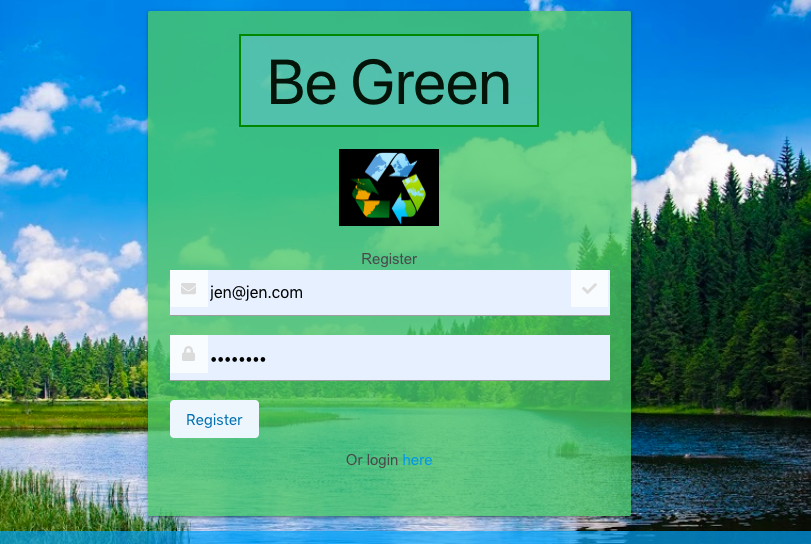
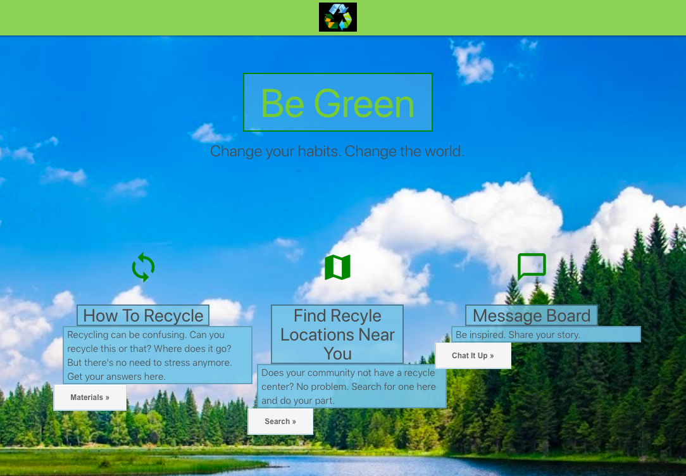

# Be-Green

A Full-Stack Web Application

Created as Project 2 during DU Coding Bootcamp. The challenge was to create a full-stack web application that utilizes the MVC paradigm and our own server-side API, AJAX calls to get, pull and push data, Node.js for back-end, Express.js for routing, MySQL for saving data, and HTML/CSS for a polished user interface.

## User Story

- AS A human,
- I WANT a centralized location where I can go to learn more about recycling in my area
- SO THAT I can be more environmentally responsible.

## Overview

BeGreen is an application that assists the user in finding more information about how to recycle, as well as local recycling centers. Future enhancements include, the ability to add a recycling center to a 'Favorites', directions to the nearest recycling center and posting/commenting to a message board.

## Utilizing the App

- Experience the deployed app on Heroku: [Here](https://dubootcampbegreen.herokuapp.com/signup "Here")
- User is routed to "Login" page, where the user can "Login" or click to "Sign Up"
- After the user signs up, they are brought to their member homepage where they can learn more about recycling and find recyling locations near them.

## Demonstrations

## Log In or Sign Up:

## Member Page

## Tech used

- HTML
- CSS
- Javascript
- jQuery
- Earth911 API
- Google Maps API
- Node.js
- MySQL
- Sequelize
- NPM packages
  - express
  - mysql2
  - passport
  - passport-local
  - sequelize
  - sequelize cli
  - express-handlebars

## Contributers

- **Matt Grove** - Full-Stack Development
- **Jen Mullin** - Full-Stack Development
- **Carina Manent** - Full-Stack Development
- **Violet, Indigo** - Full-Stack Development

test
test
test